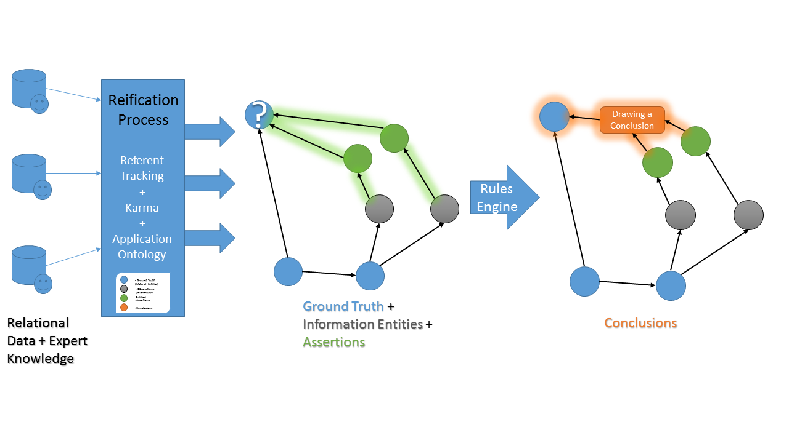

# [TURBO](http://upibi.org/turbo/)

*Transforming and Unifying Research with Biomedical Ontologies.*

The goal of the PennTURBO project is to accelerate finding and connecting key information from clinical records for research through semantic associations to the processes that generated the clinical data. Discovery of previously unappreciated relations between the data are made possible by these associations. The PennTURBO Group will be applying ontologies primarily from the Open Biological and Biomedical Ontologies (OBO) Foundry [obofoundry.org](http://http://www.obofoundry.org/) to provide a common semantic framework for Penn data. Transforming clinical data in this way allows the group to use graph database technologies for navigating the highly heterogeneous data.at 

A [TURBO paper](http://ceur-ws.org/Vol-2285/ICBO_2018_paper_12.pdf) was presented at the ICBO 2018.

A [TURBO poster](https://github.com/PennTURBO/Turbo-Documentation/blob/master/IBI_CIC_TURBO_MAM_20190102.pdf) was presented at the January 2019 Genomics and EHR workshop at Penn.

## Ontology

The TURBO group has developed an application ontology, [TURBO ontology](turbo-ontology.md), that is based on the Ontology for Biobanking and uses OBO Foundry terms wherever possible.

## Technology

The TURBO group has developed a technology stack that implements a pipeline to transform tabular data into semantic triples, stored in a Resource Description Framework (RDF) triple store, using terms from the TURBO Ontology.

TURBO also uses text analytics and machine learning for tasks like [mapping medication orders](medication_text_to_terms_to_roles.md) from an EHR to semantic terms, including the pharmaceutical roles of the mapped drugs.

## Overview of steps in TURBO

1. Export the relational data to .csv files.
1. Map the relational data files to the TURBO ontology using [Karma](karma.md).
1. Use the [Drivetrain](drivetrain.md) application to import the data into a [GraphDB](http://graphdb.ontotext.com) instance.

